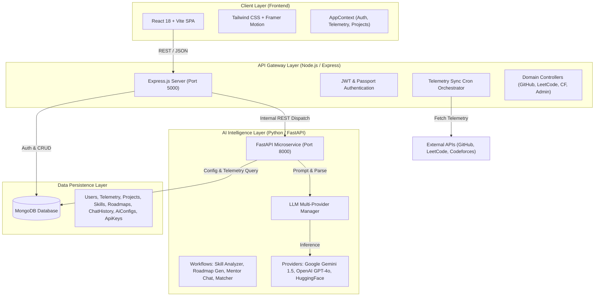

# 🚀 CareerOS — Unified Developer Portfolio & Career Intelligence Platform

[](https://nodejs.org/)
[](https://react.dev/)
[](https://fastapi.tiangolo.com/)
[](https://www.mongodb.com/)
[](https://tailwindcss.com/)
[](LICENSE)

---

## 📌 Table of Contents

1. [Executive Summary & Mission](#-executive-summary--mission)
2. [Why CareerOS? (The Problem We Solve)](#-why-careeros-the-problem-we-solve)
3. [System Architecture](#-system-architecture)
4. [Technology Stack](#-technology-stack)
5. [Core Modules & Feature Breakdown](#-core-modules--feature-breakdown)
   - [1. Multi-Platform Telemetry & Ingestion Engine](#1-multi-platform-telemetry--ingestion-engine)
   - [2. Unified Developer Dashboard & Readiness Gate](#2-unified-developer-dashboard--readiness-gate)
   - [3. Normalized Project Inventory & GitHub Sync](#3-normalized-project-inventory--github-sync)
   - [4. Skill Intelligence & Evidence Mapping](#4-skill-intelligence--evidence-mapping)
   - [5. AI Career Roadmap GPS](#5-ai-career-roadmap-gps)
   - [6. AI Company Compatibility Matcher](#6-ai-company-compatibility-matcher)
   - [7. Real-Time AI Career Mentor](#7-real-time-ai-career-mentor)
   - [8. Dynamic Readiness Reports & Analytics](#8-dynamic-readiness-reports--analytics)
   - [9. Shareable Developer Profile](#9-shareable-developer-profile)
   - [10. Enterprise Admin Console & AI Model Router](#10-enterprise-admin-console--ai-model-router)
6. [Data Pipeline & Lifecycle Flow](#-data-pipeline--lifecycle-flow)
7. [Database Schema Reference](#-database-schema-reference)
8. [Project Structure](#-project-structure)
9. [Installation & Setup Guide](#-installation--setup-guide)
   - [Prerequisites](#prerequisites)
   - [1. Backend Setup](#1-backend-setup)
   - [2. AI Microservice Setup](#2-ai-microservice-setup)
   - [3. Frontend Setup](#3-frontend-setup)
10. [Environment Variables Configuration](#-environment-variables-configuration)
11. [Security, Auth & Resilience](#-security-auth--resilience)
12. [Presentation & Academic Context](#-presentation--academic-context)
13. [Team & Collaborators](#-team--collaborators)
14. [License](#-license)

---

## 🎯 Executive Summary & Mission

**CareerOS** is a modern, full-stack developer portfolio and career intelligence platform designed to eliminate the fragmented nature of technical hiring. 

In today's engineering ecosystem, a developer's real capabilities are scattered across disjointed URLs: code commits on **GitHub**, algorithmic problem-solving on **LeetCode**, competitive ratings on **Codeforces**, data science work on **Kaggle**, live web applications, and static PDF resumes. 

CareerOS aggregates, normalizes, and verifies raw data from these disparate platforms into a **single, verified developer footprint**. Powered by a dedicated AI service with multi-model fallback chains, it automatically analyzes skill proficiencies, generates step-by-step career roadmaps, matches candidates with target engineering organizations, and provides an interactive AI mentor.

---

## 💡 Why CareerOS? (The Problem We Solve)

| The Traditional Fragmented Hiring Process | The CareerOS Unified Approach |
| :--- | :--- |
| **Tab Chaos**: Recruiters open 6+ browser tabs to evaluate GitHub, LeetCode, PDF resumes, and live demos. | **1 Unified URL**: All verified metrics, code repositories, and contest stats are presented in one cohesive profile. |
| **Static & Stale Resumes**: PDF resumes quickly become outdated and lack real-time proof of work. | **Automated Data Sync**: Live sync pull requests, commits, and problem solves directly from official platform APIs. |
| **Isolated Skill Metrics**: High LeetCode ranking does not reflect in production code quality and vice versa. | **Skill Intelligence Mapping**: Synthesizes algorithmic solves with production repository languages and project architectures. |
| **Generic Career Advice**: Standard roadmaps fail to account for a developer's exact strengths and weaknesses. | **Contextual AI Roadmaps**: Custom milestone generation targeting specific roles with step-by-step prerequisite tracking. |

---

## 🏗 System Architecture

CareerOS is built using a clean, explainable **3-Tier Microservices Architecture**:



---

## 💻 Technology Stack

### Frontend Application
- **Framework**: React 18 (Vite Bundler)
- **Styling**: Tailwind CSS (Minimal, human-centric design system with zero bloated UI dependencies)
- **Icons**: Lucide React
- **Animations**: Framer Motion
- **State Management**: React Context API (`AppContext`, `ToastContext`)
- **HTTP Client**: Axios with JWT Interceptors

### Backend API Gateway
- **Runtime**: Node.js (ES Modules)
- **Framework**: Express.js
- **Authentication**: JSON Web Tokens (JWT), Refresh Tokens (HTTP-only cookies), Passport.js (GitHub OAuth 2.0)
- **Database ORM**: Mongoose
- **File Ingestion**: Multer, `pdf-parse` (Structured resume extraction)
- **Scheduled Tasks**: `node-cron` (Automated background telemetry sync)
- **Security**: Bcrypt password hashing, CORS whitelist, sanitized input headers

### AI Microservice
- **Framework**: Python 3.10+, FastAPI, Uvicorn
- **Data Validation**: Pydantic v2 schemas
- **Database Driver**: Motor (Async MongoDB Driver)
- **LLM Integrations**: Google Generative AI (`gemini-1.5-pro`, `gemini-1.5-flash`), OpenAI API (`gpt-4o`, `gpt-4o-mini`), Hugging Face Inference API
- **Failover Engine**: Multi-tiered provider fallback chain configured dynamically in MongoDB

### Database
- **Database**: MongoDB (Atlas Cloud or Local Community Server)

---

## 🧩 Core Modules & Feature Breakdown

### 1. Multi-Platform Telemetry & Ingestion Engine
CareerOS connects directly to developer platforms to pull real-time, authentic evidence:
- **GitHub Adapter**: Fetches public repositories, star counts, commit activity, language byte distributions, and recent pull requests via the GitHub REST API. Includes an interactive repository picker modal.
- **LeetCode Adapter**: Connects via GraphQL endpoint to pull overall problems solved, difficulty tier distribution (Easy, Medium, Hard), acceptance rate, and contest rankings.
- **Codeforces Adapter**: Queries the official Codeforces API for user ratings, maximum rank titles (Candidate Master, Master, etc.), and contest history.
- **Resume Parsing Adapter**: Uploads PDF resumes, extracts raw text strings using `pdf-parse`, and passes content to the AI microservice for structured experience, education, and skill categorization.

### 2. Unified Developer Dashboard & Readiness Gate
- **Dynamic Readiness Score**: Evaluates profile completion based on connected data sources (LeetCode, Codeforces, GitHub, and at least 1 showcase project).
- **Activity Timeline**: Displays real-time sync events, milestone updates, and account audits.
- **Source Health Cards**: Instant visual indicator of connected accounts, latencies, and synchronization statuses.

### 3. Normalized Project Inventory & GitHub Sync
- **Repository Import**: Allows candidates to select repositories from their connected GitHub account or manually create custom projects.
- **Tech Stack Extraction**: Automatically tags technologies (e.g., TypeScript, React, Docker, Python).
- **Evidence & Architecture Verification**: Associates project repositories with live deployment demo links and extracted architectural highlights.

### 4. Skill Intelligence & Evidence Mapping
- **Four Skill Pillars**: Synthesizes evidence across **Languages**, **Frameworks**, **Systems & Architecture**, and **Algorithms & Problem Solving**.
- **Mastery Tiers**: Classifies skills into *Beginner*, *Intermediate*, *Advanced*, or *Expert* backed by verified commits and contest solves.
- **Delta Gap Analysis**: Compares candidate's current capabilities against target role expectations (e.g., Staff Engineer, Full-Stack Lead) and visualizes the percentage gap.

### 5. AI Career Roadmap GPS
- **Target Role Configuration**: Candidates select target engineering roles (e.g., *Backend Systems Engineer*, *Full-Stack Engineer*).
- **Structured Milestones**: AI generates chronological milestones broken down into concrete, actionable tasks with difficulty ratings and estimated completion times.
- **Interactive Checklists**: Candidates can toggle subtask completions, which persist directly back to MongoDB and recalculate overall progress.

### 6. AI Company Compatibility Matcher
- **Target Company Scoring**: Evaluates candidate readiness for top tech organizations (e.g., Google, Stripe, Meta, Netflix).
- **Compatibility Index**: Calculates a percentage match based on company-specific tech stacks, coding standards, and system design prerequisites.
- **Strengths vs. Gaps**: Highlights matching competencies alongside specific missing requirements.

### 7. Real-Time AI Career Mentor
- **Context-Aware Chat**: Ingests candidate's full live telemetry, skill profile, and roadmap milestones into the system prompt.
- **Persistent Chat History**: Stores user-mentor conversations in MongoDB under `ChatHistory`, ensuring seamless continuity across login sessions.
- **Actionable Guidance**: Provides targeted code reviews, system design interview tips, and resume phrasing advice.

### 8. Dynamic Readiness Reports & Analytics
- **Readiness Reports**: Generates downloadable / printable evaluation summaries of candidate capabilities.
- **Progress Tracking**: Tracks skill evolution over time with structured performance breakdowns.

### 9. Shareable Developer Profile
- **Public Profile View**: Clean, shareable link designed for recruiters and peers.
- **Verified Status Badge**: Badges elite profiles with verified source evidence.
- **Experience Timeline**: Displays professional background, education, and top highlighted projects.

### 10. Enterprise Admin Console & AI Model Router
- **Dynamic User Management**: View all registered users, toggle admin privileges, inspect connected sources, and trigger manual synchronization sweeps.
- **Encrypted API Key Vault**: Store and manage API keys (Google Gemini, OpenAI, GitHub, HuggingFace) with health check statuses.
- **AI Task Pipeline Routing**: Dynamically configure primary providers and fallback chains per task (`resume_parse`, `skill_analyze`, `roadmap_gen`, `company_match`, `mentor_chat`) directly from the UI without restarting servers.
- **System Audit Log**: Real-time log of security events, OAuth completions, sync tasks, and database actions.

---

## 🔄 Data Pipeline & Lifecycle Flow

```text
[User Connects Handles / Uploads Resume]
                   │
                   ▼
       [Sync Orchestrator / Controller]
                   │
     ┌─────────────┴─────────────┐
     ▼                           ▼
[GitHub / LeetCode / CF APIs] [PDF Text Extractor]
     │                           │
     └─────────────┬─────────────┘
                   │
                   ▼
     [Raw Telemetry Cached in MongoDB]
                   │
                   ▼
    [Dispatched to FastAPI AI Microservice]
                   │
     ┌─────────────┴─────────────┐
     ▼                           ▼
[LLM Provider (Gemini / OpenAI)] [Rule-based Fallback Chain]
                   │
                   ▼
      [Structured Skill Profile & Roadmap]
                   │
                   ▼
       [Persisted to MongoDB Collections]
                   │
                   ▼
    [Rendered dynamically on React Dashboard]
```

---

## 🗄 Database Schema Reference

The MongoDB database contains **8 primary collections**:

| Collection | Model File | Purpose | Key Attributes |
| :--- | :--- | :--- | :--- |
| **`users`** | [`User.js`](backend/models/User.js) | Candidate credentials, profiles, connected source handles, and roles. | `name`, `email`, `passwordHash`, `role`, `connectedSources`, `experiences`, `location`, `badge`, `readinessScore` |
| **`telemetries`** | [`Telemetry.js`](backend/models/Telemetry.js) | Cached raw API payloads from external platforms to optimize rate limits. | `userId`, `source` (github/leetcode/codeforces), `data` (mixed JSON), `fetchedAt` |
| **`projects`** | [`Project.js`](backend/models/Project.js) | Normalized showcase projects imported from GitHub or created manually. | `userId`, `name`, `desc`, `techs`, `repo`, `demo`, `sources`, `skills`, `evidence`, `activity` |
| **`skillprofiles`** | [`SkillProfile.js`](backend/models/SkillProfile.js) | Structured AI-generated candidate skill taxonomy and mastery tiers. | `userId`, `categories`, `masteryItems`, `gapAnalysis`, `trendingSkills`, `lastComputedAt` |
| **`roadmaps`** | [`Roadmap.js`](backend/models/Roadmap.js) | AI-generated career milestones and task completion checkboxes. | `userId`, `targetRoles`, `milestones` (nested array with tasks & completion states), `readiness` |
| **`chathistories`** | [`ChatHistory.js`](backend/models/ChatHistory.js) | Persistent AI Mentor conversations for session continuity. | `userId`, `sessionId`, `messages` (`sender`, `text`, `timestamp`) |
| **`aiconfigs`** | [`AiConfig.js`](backend/models/AiConfig.js) | Model routing rules and fallback chains per AI task. | `task`, `label`, `primaryProvider`, `primaryModel`, `fallbackChain`, `isActive` |
| **`apikeys`** | [`ApiKey.js`](backend/models/ApiKey.js) | Encrypted administrative API keys with health status. | `provider`, `label`, `encryptedKey`, `isActive`, `status`, `lastUsedAt` |

---

## 📂 Project Structure

```text
CareerOS/
├── ai_service/                   # Python FastAPI AI Microservice
│   ├── utils/
│   │   ├── db.py                 # Async Motor MongoDB connection
│   │   └── key_manager.py        # Dynamic API key resolver
│   ├── workflows/                # AI Prompting & Transformation Pipelines
│   │   ├── resume_parser.py      # PDF text extraction & structuring
│   │   ├── skill_analyzer.py     # Telemetry to 4-pillar skill mapping
│   │   ├── roadmap_generator.py  # Career milestone progression generator
│   │   ├── company_matcher.py    # Company compatibility index scoring
│   │   ├── mentor_chat.py        # Contextual mentor chat processor
│   │   └── progress_summary.py   # Reports progress summary generator
│   ├── llm_manager.py            # Multi-provider LLM executor with fallback chains
│   ├── main.py                   # FastAPI application & route declarations
│   └── requirements.txt          # Python dependencies
│
├── backend/                      # Node.js & Express API Gateway
│   ├── config/
│   │   ├── db.js                 # Mongoose connection setup
│   │   └── passport.js           # JWT & GitHub OAuth strategies
│   ├── controllers/              # Business Logic Controllers
│   │   ├── authController.js     # User registration, login, token refresh
│   │   ├── userController.js     # Profile updates, readiness evaluation
│   │   ├── githubController.js   # GitHub OAuth & repository picker
│   │   ├── leetcodeController.js # LeetCode GraphQL sync
│   │   ├── codeforcesController.js# Codeforces API sync
│   │   ├── projectController.js  # Project inventory CRUD
│   │   ├── resumeController.js   # PDF upload & parser proxy
│   │   ├── aiController.js       # Node-to-FastAPI bridge controller
│   │   ├── adminController.js    # User, config, and key administration
│   │   └── telemetryController.js# Raw telemetry cache retrieval
│   ├── middleware/               # Auth, Role & Multer upload middleware
│   ├── models/                   # Mongoose Database Models
│   ├── routes/                   # Express REST API Route Definitions
│   ├── services/                 # External API integration services & Cron orchestrator
│   └── server.js                 # Server entrypoint & route registry
│
├── frontend/                     # React 18 SPA (Vite)
│   ├── src/
│   │   ├── components/           # Reusable UI components (Sidebar, Topbar, Modals, Toast)
│   │   ├── context/              # AppContext & ToastContext providers
│   │   ├── pages/                # Application View Pages
│   │   │   ├── Landing.jsx       # Public high-performance landing page
│   │   │   ├── Login.jsx         # Sign in & Account registration
│   │   │   ├── Dashboard.jsx     # Candidate overview & telemetry widgets
│   │   │   ├── SkillIntelligence.jsx # Deep skill breakdown & gap analysis
│   │   │   ├── Roadmap.jsx       # Interactive career milestones GPS
│   │   │   ├── CompanyMatches.jsx# Target company compatibility scores
│   │   │   ├── Projects.jsx      # Normalized project showcase & GitHub sync
│   │   │   ├── AIMentor.jsx      # Real-time AI career mentor chat
│   │   │   ├── Reports.jsx       # Readiness evaluations & exportable analytics
│   │   │   ├── Profile.jsx       # Public/shareable developer profile
│   │   │   ├── Settings.jsx      # Handle connections & preferences
│   │   │   ├── Sources.jsx       # Data source sync diagnostics
│   │   │   └── Admin.jsx         # Comprehensive Admin Management Console
│   │   ├── services/             # Axios API service clients
│   │   ├── App.jsx               # Root route switcher & layout manager
│   │   └── index.css             # Tailwind base tokens & custom styles
│   └── vite.config.js            # Vite bundler configuration
│
├── AGENTS.md                     # Local workspace guidelines & coding principles
├── plan.md                       # Dynamic schema integration specifications
└── README.md                     # Master project documentation
```

---

## 🛠 Installation & Setup Guide

### Prerequisites
- **Node.js**: `v18.0.0` or higher
- **Python**: `v3.10` or higher
- **MongoDB**: Local MongoDB instance (`mongodb://localhost:27017`) or MongoDB Atlas URI
- **Git**: Installed and configured

---

### 1. Backend Setup

```bash
# Navigate to the backend directory
cd backend

# Install dependencies
npm install

# Create environment file from example
cp .env.example .env

# Start the development server (runs on port 5000)
npm run dev
```

---

### 2. AI Microservice Setup

```bash
# Navigate to the AI service directory
cd ../ai_service

# Create a Python virtual environment
python -m venv .venv

# Activate virtual environment:
# On Windows:
.venv\Scripts\activate
# On macOS/Linux:
source .venv/bin/activate

# Install required dependencies
pip install -r requirements.txt

# Create environment file from example
cp .env.example .env

# Start the FastAPI server (runs on port 8000)
python -m uvicorn main:app --reload --port 8000
```

---

### 3. Frontend Setup

```bash
# Navigate to the frontend directory
cd ../frontend

# Install dependencies
npm install

# Start the Vite development server (runs on port 5173)
npm run dev
```

Open [http://localhost:5173](http://localhost:5173) in your browser to view the application.

---

## ⚙ Environment Variables Configuration

### Backend (`backend/.env`)
```env
PORT=5000
NODE_ENV=development
CLIENT_URL=http://localhost:5173
AI_SERVICE_URL=http://localhost:8000

# Database
MONGO_URI=mongodb://localhost:27017/careeros

# Authentication Secrets
JWT_SECRET=your_super_secret_jwt_access_key
JWT_REFRESH_SECRET=your_super_secret_jwt_refresh_key
JWT_EXPIRES_IN=15m
JWT_REFRESH_EXPIRES_IN=7d

# Optional: GitHub OAuth (for 1-click GitHub connection)
GITHUB_CLIENT_ID=your_github_oauth_client_id
GITHUB_CLIENT_SECRET=your_github_oauth_client_secret
GITHUB_CALLBACK_URL=http://localhost:5000/api/auth/github/callback
```

### AI Service (`ai_service/.env`)
```env
MONGO_URI=mongodb://localhost:27017/careeros
PORT=8000

# AI Provider API Keys
GEMINI_API_KEY=your_google_gemini_api_key
OPENAI_API_KEY=your_openai_api_key
HUGGINGFACE_API_KEY=your_huggingface_api_key
```

### Frontend (`frontend/.env`)
```env
VITE_API_URL=http://localhost:5000/api
```

---

## 🛡 Security, Auth & Resilience

- **Dual-Token Authentication**: Access tokens (15m expiration) passed via authorization headers; Refresh tokens (7d expiration) stored in secure HTTP-only cookies.
- **Failover AI Architecture**: If Google Gemini encounters rate limits or quota exhaustion, the LLM Manager automatically falls back to OpenAI GPT-4o-mini or HuggingFace without failing the user request.
- **Role-Based Access Control (RBAC)**: Protected candidate routes vs. strict admin-only endpoints (`role === 'admin'`).
- **Encrypted Credentials**: Admin-managed API keys are stored in encrypted format in MongoDB.

---

## 🎓 Presentation & Academic Context

CareerOS was built by a **3-member engineering team** to demonstrate a clean, modern, and production-ready full-stack architecture. 

### Key Highlights for Reviewers:
1. **Zero Fake Metrics**: Telemetry is gathered from real, verified developer handles through official APIs.
2. **Microservice Separation of Concerns**: Node.js handles I/O, sync scheduling, and authentication; Python FastAPI handles compute-heavy LLM transformations.
3. **Clean Code & Explainability**: Minimalist, human-crafted design with no unnecessary enterprise bloat.

---

## 🤝 Team & Collaborators

- **Bikash Das** - Frontend - [GitHub Profile](https://github.com/Bikashthegoat)
- **Dhiman Saikia** - Frontend and Backend - [GitHub Profile](https://github.com/Dhiman07-cyber)

---

## 📄 License

This project is licensed under the **MIT License** — feel free to use, modify, and build upon it for academic and portfolio presentations.
