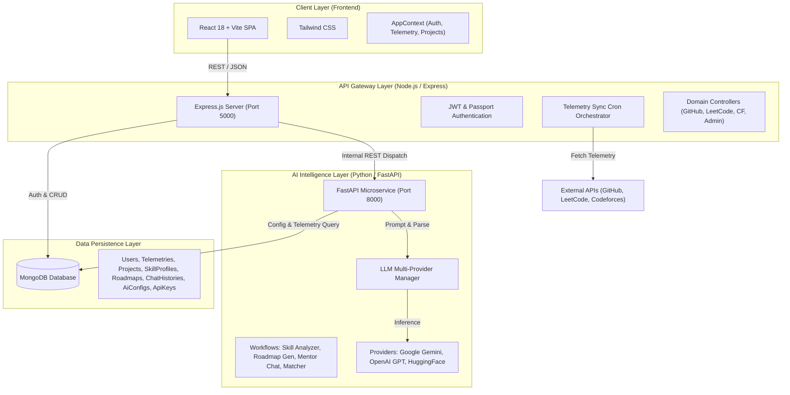

# 🏗 System Architecture & Technical Specifications — CareerOS

This document provides a comprehensive technical breakdown of the CareerOS architecture, component design, data lifecycle pipeline, database schemas, and security model.

---

## 📌 Table of Contents

1. [High-Level Architecture](#1-high-level-architecture)
2. [Component Breakdown](#2-component-breakdown)
   - [Client Layer (React Frontend)](#client-layer-react-frontend)
   - [API Gateway Layer (Node.js Express)](#api-gateway-layer-nodejs-express)
   - [AI Intelligence Layer (Python FastAPI)](#ai-intelligence-layer-python-fastapi)
   - [Data Persistence Layer (MongoDB)](#data-persistence-layer-mongodb)
3. [Technology Stack](#3-technology-stack)
4. [Core Functional Modules](#4-core-functional-modules)
5. [Data Pipeline & Lifecycle Flow](#5-data-pipeline--lifecycle-flow)
6. [Database Schema Reference](#6-database-schema-reference)
7. [Security, Authentication & Resilience](#7-security-authentication--resilience)
8. [Project Directory Layout](#8-project-directory-layout)

---

## 1. High-Level Architecture

CareerOS is built using a clean, explainable **3-Tier Microservices Architecture**:



---

## 2. Component Breakdown

### Client Layer (React Frontend)
- **Role**: Visualizes developer progress, roadmaps, readiness scores, and manages interactive workflows (project imports, mentor chat, resume uploads).
- **Communication**: Communicates exclusively with the Node.js API Gateway via REST API endpoints with Axios interceptors managing JWT auth headers and automatic token refresh.

### API Gateway Layer (Node.js Express)
- **Role**: Primary API server handling client authentication, external platform OAuth/REST integrations, background synchronization, file uploads (PDF resume extraction), and proxying AI requests to the Python microservice.
- **Port**: `5000`

### AI Intelligence Layer (Python FastAPI)
- **Role**: Dedicated microservice designed for AI compute workloads, structured JSON extraction, and dynamic multi-model orchestration.
- **Core Engine (LLM Manager)**: Provides task-specific routing, dynamic API key retrieval from MongoDB, and automated provider fallback chains (e.g. Gemini 1.5 → OpenAI GPT-4o-mini → HuggingFace) ensuring high availability even under rate limits.
- **Port**: `8000`

### Data Persistence Layer (MongoDB)
- **Role**: Centralized persistence layer shared by the Node.js backend (Mongoose) and Python AI service (Async Motor).

---

## 3. Technology Stack

| Layer | Technologies |
| :--- | :--- |
| **Frontend** | React 18, Vite, Tailwind CSS, Lucide React, Axios |
| **Backend Gateway** | Node.js (ESM), Express.js, Mongoose, JWT, Passport.js (GitHub OAuth), Multer, `pdf-parse`, `node-cron` |
| **AI Microservice** | Python 3.10+, FastAPI, Uvicorn, Motor (Async MongoDB), Pydantic v2, Google GenAI SDK, OpenAI SDK |
| **Database** | MongoDB (Local Community or MongoDB Atlas) |

---

## 4. Core Functional Modules

1. **Multi-Platform Telemetry & Ingestion Engine**
   - **GitHub**: Fetches public repositories, star counts, commit activity, language byte distributions, and recent PRs.
   - **LeetCode**: Queries GraphQL endpoints for problems solved, difficulty distributions, and contest ratings.
   - **Codeforces**: Queries official API for user ratings, rank tiers, and contest histories.
   - **Resume Parser**: Extracts unstructured text from uploaded PDFs and structures it into standardized experience and skill sets.

2. **Unified Developer Dashboard & Readiness Gate**
   - Computes weighted readiness scores based on verified external proof-of-work.
   - Real-time sync diagnostic health cards for connected accounts.

3. **Normalized Project Inventory**
   - Imports GitHub repositories with detected tech stacks and architecture tags, linking live deployment URLs with code evidence.

4. **Skill Intelligence & Evidence Mapping**
   - Groups verified abilities into 4 pillars: *Languages*, *Frameworks*, *Systems & Architecture*, and *Algorithms & Problem Solving*.
   - Evaluates mastery tiers (*Beginner*, *Intermediate*, *Advanced*, *Expert*) backed by concrete commits and solved problems.

5. **AI Career Roadmap GPS**
   - Generates sequential, actionable milestones and checklists tailored to target roles (e.g., Backend Systems Engineer).
   - Interactive checkbox progress persists back to MongoDB.

6. **AI Company Compatibility Matcher**
   - Evaluates candidate capabilities against specific tech company requirements (e.g., Google, Stripe, Meta) highlighting competency overlaps and skill deltas.

7. **Context-Aware AI Mentor**
   - Ingests candidate's full live telemetry, skill profile, and roadmap milestones into prompt context.
   - Persists chat history across sessions.

8. **Admin Console & Dynamic AI Router**
   - Manages user roles and API keys.
   - Configures model routing rules and fallback chains per task (`resume_parse`, `skill_analyze`, `roadmap_gen`, `company_match`, `mentor_chat`) dynamically without server restarts.

---

## 5. Data Pipeline & Lifecycle Flow

```text
[User Connects Handles / Uploads Resume]
                   │
                   ▼
       [Sync Orchestrator / Controller]
                   │
     ┌─────────────┴─────────────┐
     ▼                           ▼
[GitHub / LeetCode / CF APIs] [PDF Text Extractor]
     │                           │
     └─────────────┬─────────────┘
                   │
                   ▼
     [Raw Telemetry Cached in MongoDB]
                   │
                   ▼
    [Dispatched to FastAPI AI Microservice]
                   │
     ┌─────────────┴─────────────┐
     ▼                           ▼
[Primary LLM (Gemini / OpenAI)] [Rule-based Fallback Chain]
                   │
                   ▼
      [Structured Skill Profile & Roadmap]
                   │
                   ▼
       [Persisted to MongoDB Collections]
                   │
                   ▼
    [Rendered dynamically on React Dashboard]
```

---

## 6. Database Schema Reference

The database consists of **8 primary collections**:

| Collection | Model File | Purpose | Key Attributes |
| :--- | :--- | :--- | :--- |
| **`users`** | [`User.js`](../backend/models/User.js) | Candidate credentials, profiles, connected source handles, and roles. | `name`, `email`, `passwordHash`, `role`, `connectedSources`, `experiences`, `location`, `badge`, `readinessScore` |
| **`telemetries`** | [`Telemetry.js`](../backend/models/Telemetry.js) | Cached raw API payloads from external platforms to optimize rate limits. | `userId`, `source` (github/leetcode/codeforces), `data` (mixed JSON), `fetchedAt` |
| **`projects`** | [`Project.js`](../backend/models/Project.js) | Normalized showcase projects imported from GitHub or created manually. | `userId`, `name`, `desc`, `techs`, `repo`, `demo`, `sources`, `skills`, `evidence`, `activity` |
| **`skillprofiles`** | [`SkillProfile.js`](../backend/models/SkillProfile.js) | Structured AI-generated candidate skill taxonomy and mastery tiers. | `userId`, `categories`, `masteryItems`, `gapAnalysis`, `trendingSkills`, `lastComputedAt` |
| **`roadmaps`** | [`Roadmap.js`](../backend/models/Roadmap.js) | AI-generated career milestones and task completion checkboxes. | `userId`, `targetRoles`, `milestones` (nested tasks & completion flags), `readiness` |
| **`chathistories`** | [`ChatHistory.js`](../backend/models/ChatHistory.js) | Persistent AI Mentor conversations for session continuity. | `userId`, `sessionId`, `messages` (`sender`, `text`, `timestamp`) |
| **`aiconfigs`** | [`AiConfig.js`](../backend/models/AiConfig.js) | Model routing rules and fallback chains per AI task. | `task`, `label`, `primaryProvider`, `primaryModel`, `fallbackChain`, `isActive` |
| **`apikeys`** | [`ApiKey.js`](../backend/models/ApiKey.js) | Encrypted administrative API keys with health status. | `provider`, `label`, `encryptedKey`, `isActive`, `status`, `lastUsedAt` |

---

## 7. Security, Authentication & Resilience

- **Dual-Token Authentication**: Short-lived Access tokens (15m expiration) passed via HTTP Authorization headers; Refresh tokens (7d expiration) stored in secure HTTP-only cookies.
- **Failover AI Architecture**: Dynamic failover in `llm_manager.py` across Gemini, OpenAI, and HuggingFace guarantees request completion despite provider rate-limiting.
- **Role-Based Access Control (RBAC)**: Strict role separation between standard candidate routes and administrative configuration endpoints.
- **Encrypted Credentials**: Dynamic API keys configured via the Admin panel are encrypted prior to database persistence.

---

## 8. Project Directory Layout

```text
CareerOS/
├── ai_service/                   # Python FastAPI AI Microservice
│   ├── utils/                    # MongoDB motor client & key managers
│   ├── workflows/                # Task prompt pipelines (Skill, Roadmap, Matcher, Mentor)
│   ├── llm_manager.py            # Multi-provider fallback LLM engine
│   ├── main.py                   # FastAPI routes
│   └── requirements.txt          # Python dependencies
│
├── backend/                      # Node.js & Express API Gateway
│   ├── config/                   # Database & passport auth configuration
│   ├── controllers/              # Business logic & proxy endpoints
│   ├── middleware/               # Authentication & file upload middleware
│   ├── models/                   # Mongoose schemas
│   ├── routes/                   # REST route declarations
│   ├── services/                 # External telemetry adapters & cron sync
│   └── server.js                 # Backend entrypoint
│
├── frontend/                     # React 18 Single Page Application
│   ├── src/
│   │   ├── components/           # Reusable UI components
│   │   ├── context/              # App & Toast context state
│   │   ├── pages/                # Views (Dashboard, Roadmap, Skills, Matches, Admin, etc.)
│   │   ├── services/             # Axios API client integrations
│   │   └── index.css             # Tailwind design tokens
│   └── vite.config.js            # Bundler config
│
├── docs/                         # Detailed architecture, vision & integration docs
│   ├── ARCHITECTURE.md           # This document
│   ├── CONTEXT.md                # Product context, vision & user journeys
│   ├── PROJECT_DOCUMENTATION.md  # High-level project summary
│   ├── Github.md                 # GitHub integration technical details
│   ├── Leetcode.md               # LeetCode integration technical details
│   └── CodeForces.md             # Codeforces integration technical details
│
└── README.md                     # Root project documentation & setup guide
```
